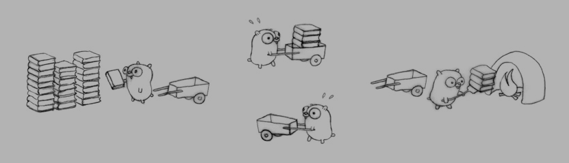

**Concurrency**: the composition of independently executing processes (structure)

**Parallelism**: the simultaneous execution of possibly related computations

Exercice:

 

Go offers primitives for processes communication (channels) and efficient parallelization (goroutines).

Don't communicate by sharing memory, share memory by communicating.

[Back](README.md)